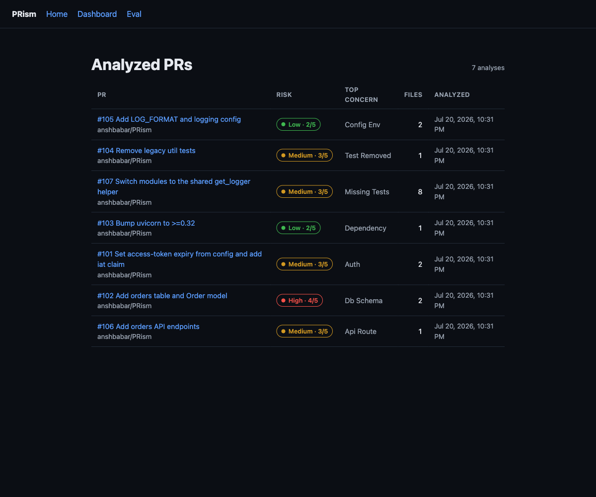
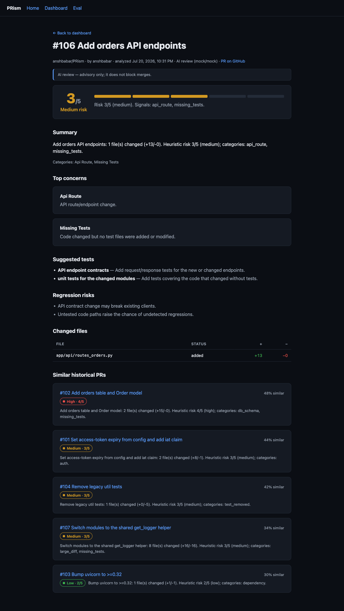
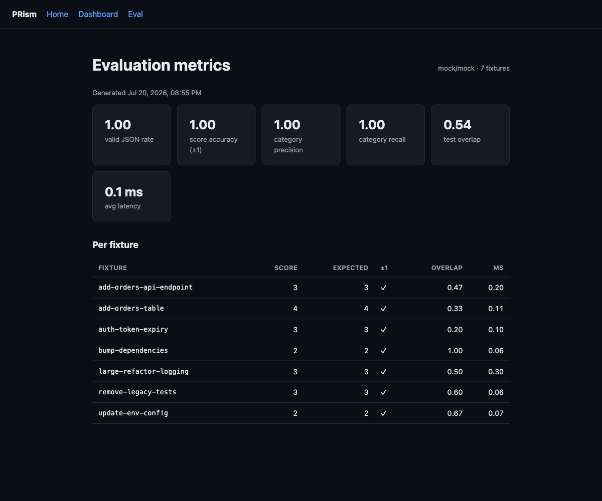

# PRism

**AI PR Reviewer + Regression Triage.**

PRism analyzes GitHub pull requests: it parses the diff, classifies risk with
deterministic heuristics, asks an LLM for a structured review (summary, 1–5 risk
score, top concerns, suggested regression tests, likely regression areas), stores
every analysis, and surfaces similar historical PRs. See
[`docs/technical-design.md`](docs/technical-design.md) for the full design.

> **Status: Milestone 6 — dashboard UI.** A clean Next.js dashboard reads the
> backend over new read endpoints (`GET /api/analyses`, `/api/analyses/{id}`,
> `/api/eval/latest`): a list of analyzed PRs, a per-PR detail page (risk score
> card, AI summary, top concerns, suggested tests, changed files, and similar
> historical PRs), and an evaluation-metrics page — all with loading and error
> states. Earlier milestones added diff parsing, rule-based risk, schema-validated
> AI review (mock provider offline by default), a reproducible evaluation harness
> (`make eval`), and Postgres persistence + similar-PR retrieval (`make seed`).

---

## Stack

| Part      | Tech |
|-----------|------|
| Backend   | Python 3.11+ (developed on 3.12), FastAPI, Pydantic v2, pydantic-settings |
| Frontend  | Next.js (App Router) + TypeScript |
| Database  | PostgreSQL 16 + pgvector (via Docker) |
| Tooling   | pip + PEP 621 `pyproject.toml`, ruff, mypy, pytest; npm, ESLint, tsc |

> **Note on packaging:** the design doc names Poetry; this repo uses a standard
> PEP 621 `pyproject.toml` installed with `pip` (works with Poetry 2.x too), so no
> Poetry install is required.

---

## Prerequisites

- Python 3.11+ (3.12 recommended)
- Node.js 20+ (developed on 26) and npm
- Docker (for local Postgres) — optional for Milestone 1, since the health check
  needs no database

---

## Quick start

```bash
# 1. Clone and enter
git clone https://github.com/anshbabar/PRism.git
cd PRism

# 2. Config
cp .env.example .env        # defaults work out of the box for local dev

# 3. Backend
make install                # creates .venv and installs backend deps
make test                   # run backend tests
make dev                    # serve API at http://localhost:8000  (try /health)

# 4. Frontend (separate terminal)
make web-install
make web                    # serve dashboard at http://localhost:3000

# 5. Database (optional in Milestone 1)
make db-up                  # start Postgres+pgvector; make db-down to stop
```

Backend API docs (Swagger) are auto-served at `http://localhost:8000/docs`.

---

## Make targets

Run `make help` for the full list. The common ones:

| Command        | What it does |
|----------------|--------------|
| `make dev`     | Run the backend API with autoreload |
| `make web`     | Run the Next.js dev server |
| `make test`    | Run backend tests (pytest) |
| `make lint`    | Lint backend (ruff) and frontend (eslint) |
| `make typecheck` | Type-check backend (mypy) and frontend (tsc) |
| `make eval`    | Run the evaluation harness (mock provider) + write `eval/results/latest.json` |
| `make db-up` / `make db-down` | Start / stop the Postgres container |
| `make migrate` | Apply database migrations (`alembic upgrade head`) |
| `make seed`    | Populate the database by analyzing every fixture |
| `make fmt`     | Auto-format backend code |

---

## Dashboard (Milestone 6)

A Next.js dashboard reads persisted analyses from the backend. Bring up the full
stack, seed some data, then run both servers:

```bash
make db-up && make migrate && make seed   # Postgres + schema + analyzed fixtures
make dev                                   # backend API at http://localhost:8000
make web                                   # dashboard at http://localhost:3000
```

The dashboard talks to the API at `NEXT_PUBLIC_API_BASE_URL` (default
`http://localhost:8000`). Three screens, each with loading + error states:

**Dashboard** — every analyzed PR with a color-coded risk badge, top concern, and
churn.



**PR detail** — risk score card, AI summary, top concerns, suggested tests,
regression risks, changed files, and similar historical PRs (with similarity %).



**Evaluation metrics** — the latest `make eval` results: metric cards + a
per-fixture breakdown.



Read endpoints powering the UI: `GET /api/analyses`, `GET /api/analyses/{id}`,
`GET /api/eval/latest`.

---

## Local fixture analysis (Milestone 2)

PRism can analyze saved PR fixtures with no GitHub App and no network — the
offline demo path. Fixtures live in `eval/fixtures/sample_prs/<name>/`, each with
`metadata.json`, `diff.patch`, and `expected.json`.

**Available fixtures:** `auth-token-expiry`, `add-orders-table`,
`bump-dependencies`, `remove-legacy-tests`, `update-env-config`,
`add-orders-api-endpoint`, `large-refactor-logging`.

Start the API, then call the endpoint with a fixture name:

```bash
make dev   # http://localhost:8000

curl -s -X POST http://localhost:8000/api/analyze/local-fixture \
  -H 'Content-Type: application/json' \
  -d '{"name": "add-orders-table"}' | python3 -m json.tool
```

The response contains the **parsed diff** (files, hunks, changed line ranges,
add/delete counts, extension, `is_test`) and a **risk result**:

```jsonc
{
  "name": "add-orders-table",
  "metadata": { "...": "..." },
  "parsed_diff": { "files_changed": 2, "total_additions": 15, "files": [ ... ] },
  "risk": {
    "score": 4,
    "band": "high",
    "signals": [
      { "category": "db_schema", "severity": 3, "file_path": "migrations/0003_add_orders.sql", "detail": "..." },
      { "category": "missing_tests", "severity": 2, "file_path": null, "detail": "..." }
    ],
    "rationale": "Risk 4/5 (high). Signals: db_schema, missing_tests."
  }
}
```

**Risk categories** (deterministic, no LLM): `auth`, `db_schema`, `api_route`,
`dependency`, `config_env`, `missing_tests`, `large_diff`, `test_removed`.
Invalid fixture names return 400; unknown names return 404.

The response also includes an `ai` object with a schema-validated review:

```jsonc
"ai": {
  "status": "completed",          // or "fallback" if model output was invalid
  "provider": "mock",             // "anthropic" when LLM_PROVIDER=anthropic
  "model": "mock",
  "review": {
    "summary": "...",
    "risk_score": 4,              // clamped to the heuristic score +/- 1
    "risk_categories": ["db_schema", "missing_tests"],
    "top_concerns": [ { "title": "...", "detail": "..." } ],   // <= 5
    "suggested_tests": [ { "area": "...", "reason": "..." } ],
    "regression_risks": ["..."],
    "github_review_markdown": "### PRism review ..."
  }
}
```

**AI provider.** `LLM_PROVIDER=mock` (default) is deterministic and offline — no
key needed, used in tests/CI. `LLM_PROVIDER=anthropic` calls Claude via the
`anthropic` SDK using structured outputs; set `ANTHROPIC_API_KEY` and (optionally)
`LLM_MODEL`. All PR content is treated as untrusted input: the prompt defends
against injection, output is schema-validated, and the risk score is clamped to
the deterministic heuristic score so a malicious diff can't force it.

Interactive docs for the endpoint: `http://localhost:8000/docs`.

---

## Evaluation harness (Milestone 4)

PRism is *measured*, not vibes. The harness runs the full analysis pipeline
(`parse → risk → AI review`) over every fixture in `eval/fixtures/sample_prs/`,
compares the output against each fixture's `expected.json`, and reports quality
metrics.

```bash
make eval                                  # mock provider + invariant checks (what CI runs)
./.venv/bin/python eval/run_eval.py        # same, without the smoke-test gate
./.venv/bin/python eval/run_eval.py --provider anthropic   # score the live Claude provider
```

Each run writes **`eval/results/latest.json`** (aggregate metrics + a per-fixture
breakdown) and prints a summary table. The reusable logic lives in `app/eval/`
(`metrics.py` = pure formulas, `runner.py` = orchestration); `eval/run_eval.py`
is a thin CLI wrapper.

**Ground truth.** Each fixture's `expected.json` carries `expected_categories`
(the risk categories that should fire), `risk_band` (`low`/`medium`/`high`), and
`expected_test_areas` (test topics a reviewer would want).

### What each metric means

| Metric | Meaning | Formula |
|---|---|---|
| `valid_json_rate` | How often the **primary** provider produced schema-valid output (heuristic fallbacks excluded). | `#{completed} / #fixtures` |
| `risk_score_accuracy_within_1` | Whether the final (clamped) risk score lands within 1 of the expected band. | band → canonical score (`low=2, medium=3, high=4`); pass if `abs(predicted − canonical) ≤ 1` |
| `risk_category_precision` | Of the categories the review flagged, how many were expected (micro-averaged). | `TP / (TP + FP)` |
| `risk_category_recall` | Of the expected categories, how many the review flagged (micro-averaged). | `TP / (TP + FN)` |
| `suggested_test_overlap` | How well suggested test areas cover the expected ones. | per expected area, best token-Jaccard vs any suggestion; averaged |
| `average_latency_ms` | Mean per-fixture pipeline wall-time. | `mean(latency_ms)` |

`suggested_test_overlap` tokenizes each area (lowercase `[a-z0-9]+`, minus a small
stopword set and 1-char tokens) and uses Jaccard similarity `|A∩B| / |A∪B|`.

### Current benchmark results

Seven fixtures, **mock provider** (offline, deterministic — the CI-tested path):

| Metric | Result |
|---|---|
| `valid_json_rate` | **1.00** |
| `risk_score_accuracy_within_1` | **1.00** |
| `risk_category_precision` | **1.00** |
| `risk_category_recall` | **1.00** |
| `suggested_test_overlap` | **0.54** |
| `average_latency_ms` | **< 1 ms** (deterministic-only; machine-dependent) |

Notes on interpreting these:

- Precision/recall of **1.00** is expected and honest: the fixtures'
  `expected_categories` are authored against the deterministic detector contract,
  so this confirms the detector matches its spec across the set (the
  `test_fixture_matches_expected` test enforces the same equality).
- `suggested_test_overlap` is intentionally a **soft** metric at **~0.54**: the
  offline mock suggests one generic area per category, so it partially — not
  fully — covers the specific expected areas. A live LLM (`--provider anthropic`)
  is expected to score higher; this is the metric that most rewards the real model.

The committed `eval/results/latest.json` lets a reviewer see the numbers without
running anything. `make eval` also enforces smoke-test invariants (≥ 5 fixtures,
and `valid_json_rate == 1.0` under the mock provider) and exits non-zero on
regression — this is the CI eval gate.

---

## Persistence + similar PRs (Milestone 5)

Every analysis is stored so PRism can answer *"have we changed this area before?"*
The pipeline persists the run, embeds it, and returns the most similar prior PRs
in the same repository.

### Run it with Postgres

```bash
make db-up        # start Postgres 16 + pgvector (docker-compose)
make migrate      # alembic upgrade head — creates the schema
make dev          # serve the API

curl -s -X POST http://localhost:8000/api/analyze/local-fixture \
  -H 'Content-Type: application/json' -d '{"name": "add-orders-table"}' | python3 -m json.tool
# analyze a related PR next; it will list the first as "similar"
curl -s -X POST http://localhost:8000/api/analyze/local-fixture \
  -H 'Content-Type: application/json' -d '{"name": "add-orders-api-endpoint"}' | python3 -m json.tool
```

The response gains three fields:

```jsonc
{
  "persisted": true,                        // false if the DB was unreachable
  "analysis_id": "78c4541d-…",              // null when not persisted
  "similar": [
    {
      "analysis_id": "…",
      "repository": "anshbabar/PRism",
      "number": 102,
      "title": "Add orders table and Order model",
      "risk_score": 4,
      "risk_band": "high",
      "similarity": 0.48,                    // cosine, 0..1
      "summary": "…"
    }
  ]
}
```

> **Offline-safe:** if Postgres isn't running, the endpoint still returns the full
> analysis with `persisted: false` and `similar: []` (a warning is logged). The
> parse → risk → review pipeline never depends on the database.

### Schema

Five tables (SQLAlchemy 2.0, portable across Postgres and the SQLite used in
tests): `repositories`, `pull_requests`, `analyses`, `changed_files`,
`embeddings`. A new push to the same PR head creates a **new `analyses` row**
(re-analysis history), never a duplicate PR. `analyses.review_json` keeps the full
LLM review verbatim and `analyses.risk_json` keeps the deterministic signals for
explainability.

### Embeddings & retrieval

The embedding provider (`EMBEDDING_PROVIDER`, default `hash`) turns
`title + summary + risk categories` into a fixed-dimension vector (`EMBED_DIM`).
The default `hash` provider is offline, deterministic, and L2-normalized, so
similar text lands close in cosine space — no API key needed. Retrieval scans
embeddings for prior analyses in the same repository, ranks them by cosine
similarity, and returns the top `SIMILAR_TOP_K`.

> **Vectors are stored as JSON and compared in Python** (a linear scan), which
> keeps the models dialect-portable and the tests hermetic (no external service).
> The `pgvector` image is already wired in docker-compose; moving similarity into
> a native `vector` column + ANN index is the documented production upgrade path.

### Migrations

Schema changes are managed with **Alembic** (`app/db/migrations/`). Apply with
`make migrate`; the database URL comes from `DATABASE_URL` (never hardcoded in
`alembic.ini`). Tests don't use Alembic — they build the schema directly on an
in-memory SQLite database.

---

## Layout

```
app/            FastAPI backend
  api/          routes (health, analyze, analyses, eval)
  core/         config + structured logging
  diff/         unified-diff parser + rule-based risk heuristics
  ai/           LLM provider abstraction, review schema, prompts, fallback
  db/           SQLAlchemy models, session, persistence, queries, seed, migrations/
  retrieval/    embedding providers + similarity search
  eval/         evaluation metrics (formulas) + harness runner
  ingest/       local PR fixture loader
  pipeline.py   shared analysis pipeline (parse → risk → review → embed)
tests/          Backend tests (pytest), incl. tests/db/, tests/retrieval/, tests/eval/
web/            Next.js + TypeScript dashboard
  app/          routes: dashboard, analyses/[id], eval (+ loading/error states)
  components/   RiskBadge, RiskScoreCard, ChangedFilesTable, SimilarPRs, …
  lib/          typed API client, shared types, formatters
docs/
  technical-design.md
  screenshots/  dashboard / detail / eval images
eval/
  run_eval.py   evaluation harness CLI
  fixtures/     sample PR fixtures (sample_prs/)
  results/      latest.json (committed benchmark output)
alembic.ini     Alembic configuration
.github/        CI workflow
docker-compose.yml   Postgres 16 + pgvector
```

---

## CI

GitHub Actions ([`.github/workflows/ci.yml`](.github/workflows/ci.yml)) runs on
every push and PR:

- **Backend:** ruff lint + format check, mypy, pytest, and an eval smoke test.
- **Frontend:** `tsc --noEmit` type-check, ESLint, and Vitest component tests.

---

## License

MIT — see [`LICENSE`](LICENSE).
